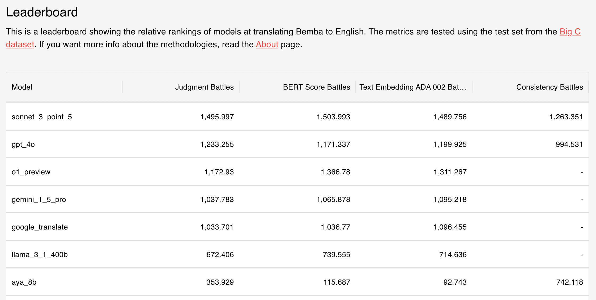
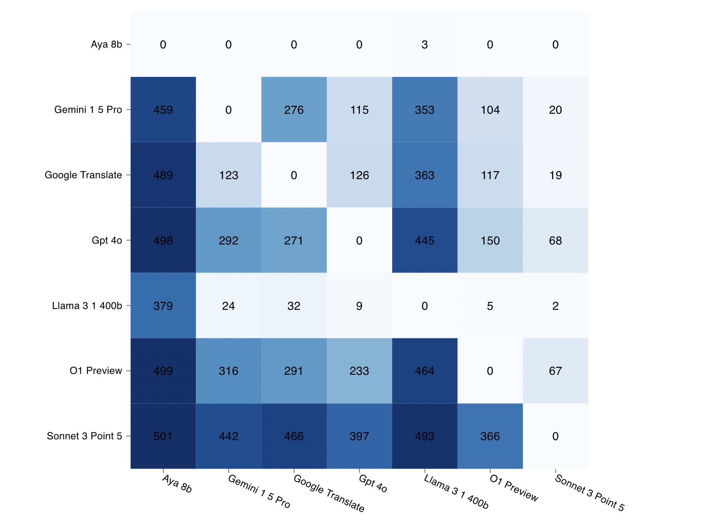

<p align="center">
  
</p>

# Bemba to English

This application provides a comprehensive leaderboard showcasing the relative rankings of models in translating Bemba to English.

**Website**: [bemba-to-english.netlify.app](https://bemba-to-english.netlify.app)

## How to Run the App

To run the app locally:

1. **Install Dependencies**: Navigate to the project directory and install the necessary dependencies using:

   ```bash
   npm install
   ```

2. **Start the App**: Run the app in development mode with:

   ```bash
   npm start
   ```

   Open [http://localhost:3000](http://localhost:3000) to view it in your browser.

## Application Overview

This application provides an interactive web interface for exploring and comparing different machine translation models for translating Bemba to English. Below is an overview of the key pages of the website:

### Leaderboard

The **Leaderboard** displays the relative rankings of models based on various evaluation metrics. Users can view and sort the models to see how they perform according to different criteria.



- **File Reference**: [`App.js`](src/App.js)

  ```javascript:src/App.js
  function AppContent() {
    // ...
    {/* DataGrid Table */}
    <Box
      sx={{
        height: 450,
        width: '100%',
        overflow: 'auto',
        mb: 1,
      }}
    >
      <DataGrid
        rows={rows}
        columns={columns}
        disableSelectionOnClick
        hideFooter
        onRowClick={(params) => {
          navigate(`/model/${params.row.model}`);
        }}
        // ...
      />
    </Box>
    // ...
  }
  ```

  The `AppContent` component handles the rendering of the Leaderboard table using `DataGrid`, displaying the models and their rankings.

### Head-to-Head Comparison

The **Head-to-Head** page provides a heatmap visualization that allows users to compare models directly against each other based on different metrics.



- **File Reference**: [`HeadToHead.js`](src/HeadToHead.js)

  ```javascript:src/HeadToHead.js
  function HeadToHead() {
    // ...
    <ResponsiveHeatMap
      data={prepareHeatmapData(battleType)}
      margin={{ top: 20, right: 20, bottom: 80, left: 80 }}
      // ...
      onClick={(cell, event) => {
        // Extract model names from the cell object
        const model1 = cell.serieId;
        const model2 = cell.data.x;

        // Navigate to the comparison page with encoded formatted model names
        navigate(
          `/compare/${encodeURIComponent(formatModelName(model1))}/${encodeURIComponent(formatModelName(model2))}`
        );
      }}
      // ...
    />
    // ...
  }
  ```

  The `HeadToHead` component renders the heatmap visualization using `@nivo/heatmap` and handles user interactions for model comparisons.

### Model Details

The **Model Details** page displays detailed translation outputs for a selected model. Users can explore the translations along with their associated scores for each test instance.

- **File Reference**: [`ModelDetails.js`](src/ModelDetails.js)

  ```javascript:src/ModelDetails.js
  function ModelDetails() {
    // ...
    <TableContainer component={Paper}>
      <Table stickyHeader={true}>
        <TableHead>
          <TableRow>
            <TableCell>ID</TableCell>
            <TableCell>Original (Bemba)</TableCell>
            <TableCell>Translation</TableCell>
            <TableCell>BERT Score</TableCell>
            <TableCell>Similarity Score</TableCell>
          </TableRow>
        </TableHead>
        <TableBody>
          {Object.entries(modelData.data).map(([id, entry]) => {
            // ...
            return (
              <TableRow key={id}>
                {/* Table Cells */}
              </TableRow>
            );
          })}
        </TableBody>
      </Table>
    </TableContainer>
    // ...
  }
  ```

  The `ModelDetails` component fetches and displays the selected model's translation data in a table format.

### Model Comparison

The **Model Comparison** page allows users to compare the translation outputs of two models side-by-side. It displays the original Bemba sentences along with each model's translation and the winner according to different metrics for each test instance.

- **File Reference**: [`ModelComparison.js`](src/ModelComparison.js)

  ```javascript:src/ModelComparison.js
  function ModelComparison() {
    // ...
    <DataGrid
      rows={rows}
      columns={columns}
      getRowHeight={getRowHeight}
      onRowClick={handleRowClick}
      // ...
    />
    // ...
  }
  ```

  The `ModelComparison` component handles fetching the battle data between two models and presents it using `DataGrid`.

## Data Management

To optimize the build time and ensure efficient rendering of the application, most of the data used by the application is stored in the `public` folder. Only essential data and components are included in the `src` folder to maintain a lightweight build.

- **Data in `src`**: Includes essential data and components required during the development and building of the app.
- **Data in `public`**: Contains most of the large datasets and JSON files that are fetched at runtime, reducing the build size and improving performance.

## About

This application provides a comprehensive leaderboard showcasing the relative rankings of models in translating Bemba to English. The models are evaluated using the test set from the [Big C dataset](https://github.com/csikasote/bigc).

### Metrics and Methodologies

The models are evaluated based on several metrics, each designed to assess different aspects of translation quality. The rankings are determined using ELO ratings computed from these metrics.

#### Judgment Battles

In Judgment Battles, models are compared based on human-like judgments rendered by advanced language models (e.g., GPT-4). For each test instance, translations from two models are presented along with the original conversation in English. The language model acts as an evaluator, judging which translation is closer in meaning to the original conversation.

#### BERTScore Battles

BERTScore utilizes contextual embeddings from pretrained BERT models to evaluate the similarity between candidate translations and reference translations.

#### Text Embedding ADA-002 Battles

This metric evaluates models using embeddings from OpenAI's `text-embedding-ada-002` model. By converting texts into high-dimensional embeddings, we can compute cosine similarity scores to assess semantic similarity.

#### Consistency Battles

Consistency Battles measure how consistently a model translates when using a high temperature setting, while keeping all other conditions exactly the same. High temperature introduces randomness in the generation process, and models that produce consistent translations under these conditions are generally considered to be more correct. The assumption is that consistency aligns with correctness, and this has been validated by the alignment of these rankings with those from our other traditional metrics.

### ELO Rating System

The ELO rating system provides a method to rank models based on their relative performance in pairwise battles across all metrics.

## Additional Information

For more detailed information about the methodologies, implementation details, or to access the data and code used in this project, please refer to our [Python Repository](https://github.com/eliplutchok/bemba-to-english-python).

If you have any questions or would like to contribute, feel free to open an issue or submit a pull request.
